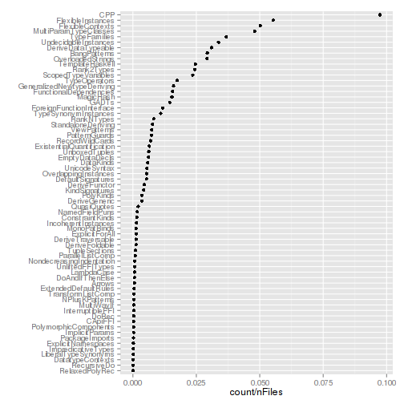
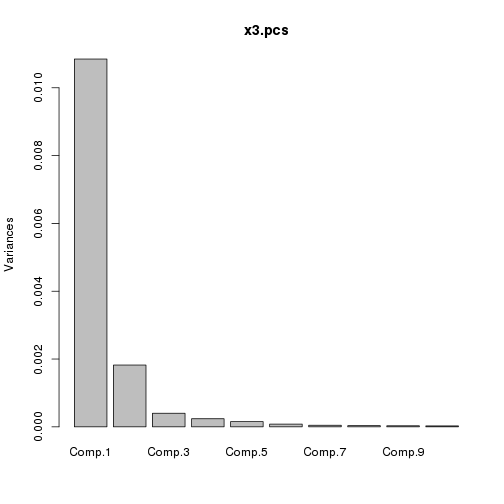

# Haskell Language Pragma Popularity
The gist of it:

* Certain extensions in haskell are more popular than others.
* Certain extensions appear together.
* Completions in IDEs etc. can take advantage of this.

<!--pandoc
format:html
standalone:
-->


```r
library(knitr)
opts_chunk$set(cache = T, tidy = F)
```


Run the cabalf.hs, which searches through all packages you have in `$HOME/.cabal/packages/hackage.haskell.org` (for now) and produces the file `generated/pp.csv`.

```r
library(ggplot2); library(plyr)
library(reshape2)
system('ghc -package ghc -O2 cabalf.hs')
system('./cabalf; mkdir generated; mv pp.csv generated')
x <- read.csv('generated/pp.csv')
xext <- ddply(x, .(ext), function(x) c(count=sum(x$count)))
nFiles <- nlevels(interaction(x$pkg, x$fileid))
```

By far, the C preprocessor occurs the most times.

```r
plot(ggplot(xext, aes(count / nFiles, reorder(ext, count)))
     + geom_point()
     + ylab(''))
```

 

## more involved predictions
The overall frequency in the above graph may not tell the whole story: certain extensions tend to be enabled together. Here is a principal-components analysis. The order in which the completions are supplied matches the principal component that matches the currently enabled extensions the best. An artificial neural network (ANN) uses similar ideas,but has the following advantage: this PCA-based method doesn't care about the signs, so a file with extensions `A` and `C` enabled will give the same prediction as a file with just `B` enabled.

```r
x2 <- ddply(x, .(pkg), function(x)
            within(count(x, c('ext'), 'count'),
                   freq <- freq/sum(freq)))
x3 <- dcast(x2, ext ~ pkg, fill=0)
```

```
## Using freq as value column: use value.var to override.
```

```r
x3.pcs <- princomp(t(x3[, -1]))
plot(x3.pcs)
```

 


```r
nc <- 5
comp <- paste('comp = [ [',
      do.call('paste0', list(collapse='], [',
                            lapply(1:nc, function(i)
                                   paste0(paste0('("',
                                               x3[order(x3.pcs$loadings[ , i]),1],
                                               '",',
                                               x3.pcs$loadings[, i] *
                                               x3.pcs$sdev,
                                               ')\n  '),
                                    collapse=',')))),
      ']]')

writeLines(c('module RateLang (rateLang) where
import qualified Data.Map as M
import Data.Maybe
import Data.Ord
import Data.List
rateLang :: [String] -> [String]
rateLang enabled =
  let s = reverse $ -- maximumBy takes the last if all EQ
                    -- we want the first, which is the strongest component
            zipWith (\\ cm c -> (abs $ sum $ mapMaybe (`M.lookup` cm) enabled,
                               c)) 
                comp2
                comp
  in map fst (snd (maximumBy (comparing fst) s)) \\\\ enabled
comp2 = map M.fromList comp
', comp
            ), con=file('generated/RateLang.hs'))
```

